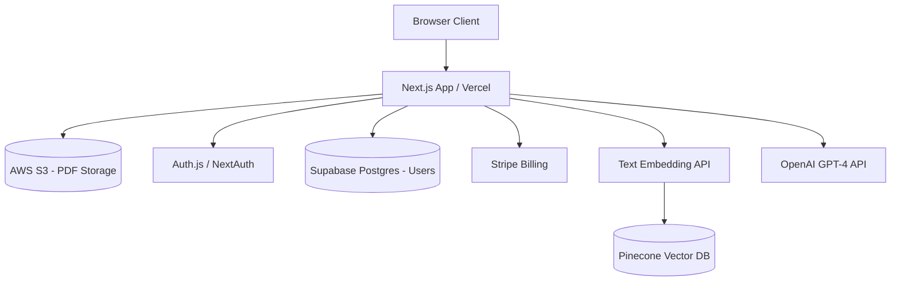

# AI SaaS: Document Analyzer

> **Author**: Open Source Team  
> **Difficulty**: Intermediate  
> **Tags**: `Next.js`, `Serverless`, `OpenAI`, `Pinecone`

## 1. Executive Summary
This blueprint describes an AI Software-as-a-Service (SaaS) application where users can upload large PDF documents, and the system extracts, chunks, and stores the text in a Vector Database. Users can then "chat" with their documents using an LLM.

---

## 2. System Architecture Diagram

---

## 3. Core Components Breakdown

### Frontend (Next.js App Router)
- **Framework**: Next.js 14+ using the App Router.
- **UI Components**: React components styled with Tailwind CSS or standard CSS.
- **State**: React Query or standard React state for handling the chat interface and streaming responses.

### Data Processing Pipeline
When a user uploads a PDF:
1. **Storage**: The raw PDF is saved to an AWS S3 bucket.
2. **Extraction**: A serverless function extracts the raw text from the PDF.
3. **Chunking**: The text is split into small chunks (e.g., 500 words each).
4. **Embedding**: Each chunk is sent to an embedding model (like `text-embedding-3-small`) to convert the text into numerical vectors.
5. **Vector Storage**: The vectors are saved to a Vector Database (like Pinecone) so we can perform semantic search later.

### Chat Interface
When the user asks a question:
1. The question is converted into a vector.
2. The system queries Pinecone to find the top 3 most relevant chunks from the PDF.
3. Those chunks are injected into a prompt alongside the user's question.
4. The prompt is sent to OpenAI's GPT-4, and the answer is streamed back to the frontend.

---

## 4. Trade-offs & Considerations
- **Pros**: Entirely serverless. You pay exactly for what you use, and it scales infinitely without managing servers.
- **Cons**: Cold starts on serverless functions can delay the initial document processing by a few seconds. Vercel function execution limits (10-60 seconds depending on plan) mean very large PDFs must be processed via background queues (like Upstash QStash).
