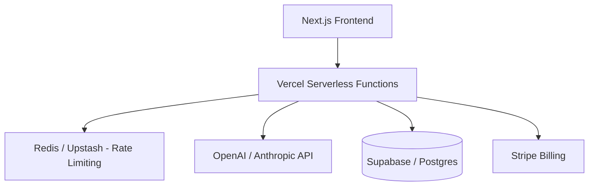

# AI SaaS Architecture

Modern AI SaaS platforms typically involve a heavy frontend, an async task queue for LLM processing, and a scalable database.

```mermaid
graph TD;
    Client[Next.js Frontend] --> Vercel[Vercel Serverless Functions];
    Vercel --> Redis[Redis / Upstash - Rate Limiting];
    Vercel --> OpenAI[OpenAI / Anthropic API];
    Vercel --> DB[(Supabase / Postgres)];
    Vercel --> Stripe[Stripe Billing];
```
