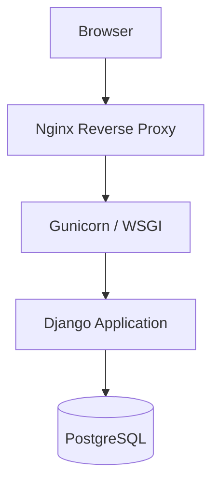

# Django Stack Architecture

Django is a high-level Python web framework that encourages rapid development and clean, pragmatic design. It typically pairs well with PostgreSQL.

```mermaid
graph TD;
    Client[Browser] --> Nginx[Nginx Reverse Proxy];
    Nginx --> Gunicorn[Gunicorn / WSGI];
    Gunicorn --> Django[Django Application];
    Django --> DB[(PostgreSQL)];
```
