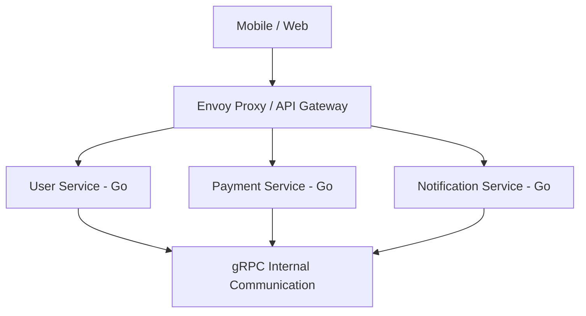

# Golang Microservices Architecture

Go (Golang) is highly favored for microservices due to its concurrency model, fast execution, and small memory footprint.

```mermaid
graph TD;
    Client[Mobile / Web] --> API_Gateway[Envoy Proxy / API Gateway];
    API_Gateway --> UserSvc[User Service - Go];
    API_Gateway --> PaymentSvc[Payment Service - Go];
    API_Gateway --> NotificationSvc[Notification Service - Go];
    
    UserSvc --> gRPC[gRPC Internal Communication];
    PaymentSvc --> gRPC;
    NotificationSvc --> gRPC;
```
