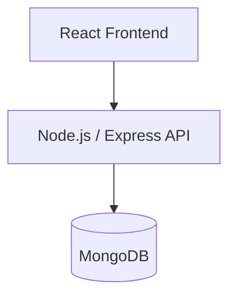

# MERN Stack Architecture

The MERN stack (MongoDB, Express, React, Node.js) is a popular JavaScript-centric approach to building full-stack web applications.

```mermaid
graph TD;
    Client[React Frontend] --> API[Node.js / Express API];
    API --> DB[(MongoDB)];
```
