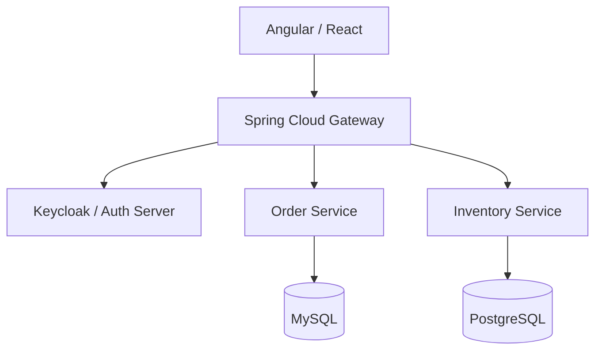

# Spring Boot Enterprise Architecture

Spring Boot is an extension of the Spring framework that helps developers build stand-alone, production-grade Spring-based applications quickly.

```mermaid
graph TD;
    Client[Angular / React] --> Gateway[Spring Cloud Gateway];
    Gateway --> Auth[Keycloak / Auth Server];
    Gateway --> ServiceA[Order Service];
    Gateway --> ServiceB[Inventory Service];
    ServiceA --> DB1[(MySQL)];
    ServiceB --> DB2[(PostgreSQL)];
```
