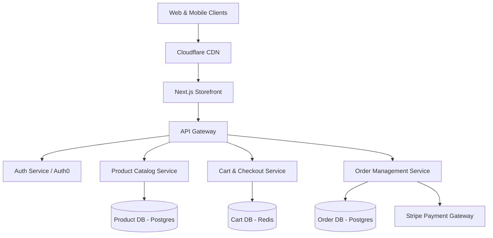

# E-Commerce Platform Blueprint

> **Author**: Open Source Team
> **Version**: 1.0.0
> **Last Updated**: 2026-06-12

## 1. Overview
This blueprint describes a modern, highly scalable e-commerce architecture suitable for mid-to-large scale online retailers. It separates the frontend storefront from the backend commerce engine using a Headless Commerce approach.

## 2. Architecture Diagram

## 3. Core Components
- **Frontend**: Next.js (React), deployed on Vercel. Ensures fast server-side rendering for SEO.
- **Backend API**: Node.js microservices (or Go for high-throughput services like Inventory).
- **Databases**: 
  - PostgreSQL for relational data (Products, Orders, Users).
  - Redis for ephemeral/fast-access data (Shopping Cart, Session).
- **Payment Processing**: Stripe API.

## 4. Trade-offs & Considerations
* **Pros:**
  * Highly scalable. You can scale the Cart service independently from the Product service during high-traffic events (e.g., Black Friday).
  * Excellent SEO and fast initial load times due to Next.js.
* **Cons:**
  * Requires operational maturity to manage multiple microservices.
  * Higher initial infrastructure cost.

## 5. Deployment Strategy
- **Frontend**: Vercel for Edge Network and seamless Next.js support.
- **Backend**: AWS Elastic Kubernetes Service (EKS) or ECS for container orchestration.
- **CI/CD**: GitHub Actions to build Docker images and deploy to AWS.
