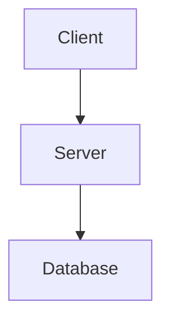

# 🚀 Getting Started Guide

Welcome to Software Blueprints! This repository is organized into a strict **3-Pillar Architecture** to keep the sidebar clean and intuitive.

Whether you are a frontend developer adding new React components, or a backend architect documenting a Django setup, you must follow this absolute documentation to structure your work.

---

## 🏛️ The Directory Structure

Everything in this project lives inside the `docs/` folder. It is split into three main categories:

1. `frontend/` - UI component libraries (e.g. React, Vue, Svelte)
2. `backend/` - Architecture blueprints (e.g. Django, Node, Spring Boot)
3. `full-stack/` - End-to-end boilerplates (e.g. AI SaaS, E-commerce)

Docusaurus **automatically generates the sidebar** based on this folder structure. You do not need to manually edit `sidebars.js`.

---

## 📁 How to Add a New Technology Category

Let's say you want to add a new frontend library for **Vue.js**.

**1. Create a Folder**
Create a new folder inside the correct pillar:
`docs/frontend/vue/`

**2. Add a `_category_.json` File**
To ensure the sidebar displays the name beautifully (with capital letters), create a `_category_.json` file inside your new folder:

```json title="docs/frontend/vue/_category_.json"
{
  "label": "Vue UI Templates",
  "position": 2
}
```
*The `position` controls where it appears in the list (1 comes first).*

---

## 📄 How to Add a New Component or Blueprint Page

Once your category folder exists, you can add Markdown (`.md` or `.mdx`) files inside it. 

### Step 1: Create the file
Create your file, for example: `docs/frontend/vue/buttons.mdx`.

### Step 2: Add the Frontmatter
At the very top of your file, you MUST include this block (called Frontmatter) to tell Docusaurus the title and sidebar position of the page:

```markdown
---
sidebar_position: 1
title: "Button Components"
---
```

### Step 3: Write your Content (Standard Markdown)
If you are writing a standard backend architecture blueprint, you can just write normal Markdown. You can even include Mermaid diagrams!

<pre>

</pre>

## 📑 Step 4: Grouping Multiple Variants (The 1, 2, 3 Method)
When building UI components, you should put multiple variants of the same component (e.g., Solid Buttons, Outline Buttons) into the *same* file.

To ensure Docusaurus automatically builds a beautiful "On this page" Table of Contents on the right side of the screen, you MUST use `##` (H2) headers with numbers for each variant. 

For example, structure your file exactly like this:

```mdx
---
sidebar_position: 1
title: "Button Components"
---

# Button Components
Brief description of the buttons...

## 1. Solid Buttons (Standard)
<Tabs>
  {/* Tab Code Here */}
</Tabs>

## 2. Outline Buttons
<Tabs>
  {/* Tab Code Here */}
</Tabs>

## 3. Ghost / Text Buttons
<Tabs>
  {/* Tab Code Here */}
</Tabs>
```

By using the `## 1. Name` format, your components will be perfectly organized and easy to navigate!

---

## 💻 Step 5: Adding Interactive UI Previews (MDX Tabs)
For each variant under your `##` header, we require you to use the **Preview & Code Tabs** pattern.

Import the Tabs component right below your frontmatter, and structure your code like this:

````mdx
---
sidebar_position: 2
title: "Hero Sections"
---

import Tabs from '@theme/Tabs';
import TabItem from '@theme/TabItem';

# Hero Sections

## 1. Dark Mode Hero

<Tabs>
  <TabItem value="preview" label="Preview" default>
    {/* 1. Put the actual running visual component here */}
    <div style={{ padding: '20px', background: '#111', color: 'white' }}>
      <h1>Welcome to the Future.</h1>
      <button>Get Started</button>
    </div>
  </TabItem>

  <TabItem value="code" label="Code">
    {/* 2. Put the code snippet here inside a markdown block */}
    ```jsx
    export default function Hero() {
      return (
        <div className="hero-dark">
          <h1>Welcome to the Future.</h1>
          <button>Get Started</button>
        </div>
      );
    }
    ```
  </TabItem>
</Tabs>
````

---

## ⛔ Strict Contribution Boundaries (Where NOT to touch)

To prevent breaking the Docusaurus architecture or merge conflicts, **you must abide by these strict boundaries:**

1. **DO NOT modify `docusaurus.config.ts` or `sidebars.ts`.** The navigation is entirely auto-generated based on the `docs/` folder structure. You do not need to touch configuration files.
2. **DO NOT create files in the `src/` directory.** The `src/` directory is reserved for core Docusaurus overrides (like the Homepage UI or custom CSS). Component templates do not belong there.
3. **ONLY create files inside `docs/frontend`, `docs/backend`, or `docs/full-stack`.** 
4. **DO NOT create files at the root level.**

If your Pull Request modifies files outside the `docs/` pillars without explicit permission from a Lead Maintainer, it will be automatically rejected.

---

## 🚦 Final Checklist

Before you open a Pull Request, always ask yourself:
1. Did I put my file in the correct pillar (`frontend`, `backend`, `full-stack`)?
2. Did I include the `---` Frontmatter with a `title` and `sidebar_position`?
3. If it is a UI component, did I use `<Tabs>` for Preview and Code?
4. **Did I follow the strict Enterprise Rules listed in `CONTRIBUTING.md`?**
